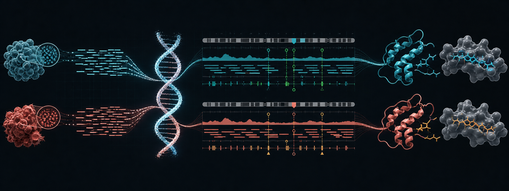
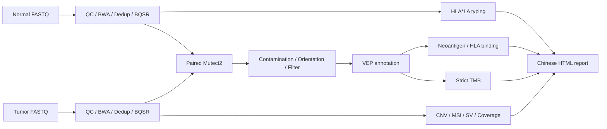

# GAOMEI WES

<p align="center">
  
</p>

<p align="center">
  <strong>面向肿瘤-正常配对与单样本分析的可复现 WES 工作流</strong>
</p>

<p align="center">
  <a href="https://github.com/Defphoenix/gaomei_wes/releases/tag/v1.0.0"></a>
  <a href="https://github.com/Defphoenix/gaomei_wes/actions/workflows/code-tests.yml"></a>
  <a href="#2-使用-mamba-创建环境"></a>
  
</p>

<p align="center">
  
  
  
  
  
  
</p>

<p align="center">
  <strong>中文</strong> | <a href="README_EN.md">English</a> |
  <a href="docs/V1.0_zh.md">v1.0 说明</a> |
  <a href="docs/install_update_zh.md">安装与升级</a> |
  <a href="docs/software_database_inventory.md">软件与数据库</a>
</p>

这是一个以 Shell/Python 实现、可在服务器直接部署的 WES 分析项目，支持单样本
胚系检测和肿瘤-正常配对体细胞检测，并保留单步调试入口。当前版本适合研发、
benchmark 和流程验证；正式临床或工业交付前仍需完成 PoN、CNV/MSI
基线、临床知识库和队列级验证。当前已接入 Mutect2 污染/方向偏倚校正、
HLA*LA 分型和严格 VEP TMB，但仍须使用本实验体系验证。详细审计见
[流程审计与更新路线](docs/pipeline_audit_zh.md)。首次部署或升级请先看
[安装与版本更新指南](docs/install_update_zh.md)。
从全新环境开始复测请使用
[全新安装与真实配对样本复测手册](docs/clean_reinstall_revalidation_zh.md)。
当前稳定研发版说明见 [v1.0版本说明](docs/V1.0_zh.md)，变更记录见
[CHANGELOG](CHANGELOG.md)。

### 真实配对样本回归状态

2026-07 已完成一组真实 WES tumor-normal 数据的端到端研发验证。该次验证推动了
以下修复，并已加入自动回归测试：BQSR BAM 完整性检查、Picard 3.4 参数兼容、
VEP cache 路径校验、MSIsensor 原始结果与生成摘要隔离、Mutect2 正式下采样参数、
CNVkit matched-normal 基线，以及可选的 bedtools 慢速交叉统计。PoN、gnomAD
AF-only resource、同平台 CNV pooled reference 和经过 panel 验证的 MSI/TMB 阈值
仍属于正式上线前必须补齐的队列资源。

## 流程总览



配对模式不会为两份 BAM 分别重复调用变异：

```text
Normal FASTQ -> Normal BQSR BAM -> HLA typing
Tumor FASTQ  -> Tumor BQSR BAM
Normal BQSR BAM + Tumor BQSR BAM -> 一次 paired Mutect2 -> 后续体细胞分析
```

生成的 `normal` 和 `tumor` 子命令由 `through 5d` 限定在预处理阶段；只有
`somatic` 配置启用步骤6以后各模块。单样本胚系模式仍会运行 HaplotypeCaller。

### 平台与发布边界

| 项目 | v1.0 状态 |
|------|-----------|
| Mamba / Conda | 官方推荐安装方式，按 prefix 创建六套隔离环境 |
| Linux x86_64 | 生产部署目标；HLA*LA 和服务器真实样本验证基于 Linux |
| macOS | 支持代码开发和小型模拟测试；HLA*LA 等 Linux 工具不保证完整运行 |
| Debian / Ubuntu | 通常可通过 Mamba 部署，但当前不是 Debian 官方软件包 |
| Galaxy / European Galaxy | 尚未提供 Galaxy tool wrapper，也未发布到 European Galaxy server |
| 临床使用 | 当前仅限科研、研发和流程验证，不可直接用于临床诊断 |

> 徽章只描述已经实现或验证的能力。等完成 Debian 打包或 Galaxy tool wrapper
> 后，再添加对应的官方安装徽章和 Galaxy server 标识。

## 分析模块 (共19步)

| 步骤 | 脚本 | 工具 | 模块 | 说明 |
|------|------|------|------|------|
| 1 | `01_fastqc.sh` | FastQC | 质控 | 原始数据质量评估 |
| 2 | `02_trim.sh` | fastp / Trimmomatic | 质控 | Adapter去除 & 低质量过滤 |
| 3 | `03_align.sh` | BWA-MEM | 比对 | 序列比对到参考基因组 |
| 4 | `04_sort_index.sh` | Samtools | 比对 | BAM排序和索引 |
| 5 | `05_mark_duplicates.sh` | Picard / Samtools | 比对 | 标记PCR重复 |
| 5b | `05b_post_align_qc.sh` | Picard, Samtools, Qualimap | QC | 插入片段大小、GC偏差、文库复杂度 |
| 5c | `05c_bqsr.sh` | GATK BQSR | 校准 | 碱基质量分数重校准 |
| 5d | `05d_hla_typing.sh` | HLA*LA | HLA | WES BAM高分辨率G-group分型，并生成binding兼容等位基因 |
| 6 | `06_variant_calling.sh` | GATK HC / Mutect2 | 变异 | SNV/InDel检测 |
| 7 | `07_variant_filter.sh` | GATK, BCFtools | 变异 | LearnReadOrientationModel、污染估计和Mutect2过滤 |
| 7b | `07b_snpeff.sh` | SnpEff, SnpSift | 注释 | 功能注释；可选叠加ClinVar/COSMIC |
| 7c | `07c_vep.sh` | Ensembl VEP | 注释 | 转录本后果、SIFT/PolyPhen、已知变异；CADD/REVEL需插件数据 |
| 7d | `07d_neoantigen.sh` | Python, MHCflurry/NetMHCpan(可选) | 新抗原 | 从VEP注释VCF生成候选肽FASTA和HLA结合预测 |
| 8 | `08_cnv.sh` | CNVkit / mosdepth | CNV | 有matched/pooled normal时运行CNVkit；否则仅输出明确标注的depth QC |
| 9 | `09_msi.sh` | MSIsensor-pro | MSI | 微卫星不稳定性检测 |
| 10 | `10_sv.sh` | Manta | SV | 结构变异 (缺失/插入/倒位/易位) |
| 11 | `11_coverage.sh` | mosdepth, bedtools | 覆盖度 | 目标区域深度统计 |
| 12 | `12_tmb.sh` | Python, VEP CSQ | TMB | 配对证据、群体频率和有效编码区严格TMB计算 |
| 13 | `13_final_summary.sh` | MultiQC | 汇总 | 综合QC报告 + 全模块汇总 |

## 项目结构

```
mutation_pipeline/
├── config.sh                     # 配置文件 (运行前必须修改!)
├── run_pipeline.sh               # 主控脚本
├── scripts/
│   ├── utils.sh                  # 公共工具函数
│   ├── 01_fastqc.sh              # FastQC质控
│   ├── 02_trim.sh                # 数据修剪
│   ├── 03_align.sh               # BWA比对
│   ├── 04_sort_index.sh          # 排序索引
│   ├── 05_mark_duplicates.sh     # 标记重复
│   ├── 05b_post_align_qc.sh     # 比对后QC
│   ├── 05c_bqsr.sh              # BQSR校准
│   ├── 05d_hla_typing.sh        # HLA*LA分型
│   ├── prepare_hlala_graph.sh    # HLA*LA graph校验、链接和prepare
│   ├── 06_variant_calling.sh     # 变异检测
│   ├── 07_variant_filter.sh      # 变异过滤
│   ├── 07b_snpeff.sh            # SnpEff注释
│   ├── 07c_vep.sh               # VEP注释
│   ├── 07d_neoantigen.sh        # 新抗原候选肽
│   ├── neoantigen_from_vep.py   # VEP CSQ解析和肽段生成
│   ├── 08_cnv.sh                # CNV分析
│   ├── 09_msi.sh                # MSI检测
│   ├── 10_sv.sh                 # 结构变异
│   ├── 11_coverage.sh           # 覆盖度分析
│   ├── 12_tmb.sh                # TMB计算
│   ├── tmb_from_vep.py          # 严格VEP TMB筛选
│   └── 13_final_summary.sh      # 汇总报告
├── data/                         # 原始FASTQ数据
├── results/                      # 分析结果
│   ├── fastqc/                   # FastQC报告
│   ├── trimmed/                  # 修剪后FASTQ
│   ├── aligned/                  # BAM比对文件
│   ├── post_align_qc/            # 比对后QC指标
│   ├── bqsr/                     # BQSR校准BAM
│   ├── hla_typing/               # HLA完整分型和binding等位基因
│   ├── variants/                 # 原始变异结果
│   ├── annotation/               # 注释结果 (SnpEff/VEP)
│   ├── neoantigen/               # 新抗原候选肽和HLA预测
│   ├── cnv/                      # CNV分析结果
│   ├── sv/                       # 结构变异结果
│   ├── msi/                      # MSI检测结果
│   ├── coverage/                 # 覆盖度分析
│   ├── tmb/                      # TMB计算结果
│   ├── summary/                  # 综合报告
│   └── multiqc/                  # MultiQC报告
├── logs/                         # 运行日志
└── README.md                     # 本文件
```

## 快速开始

推荐服务器使用方式是：`git clone` 本仓库，使用 `mamba` 按 prefix 创建环境，
之后所有项目都引用同一套环境。服务器部署、混样 benchmark、项目自动生成请看:

```text
docs/install_update_zh.md
docs/server_deployment_and_mix_test.md
```

### 1. 获取代码

```bash
git clone git@github.com:Defphoenix/gaomei_wes.git
cd gaomei_wes
```

如果服务器没有配置 GitHub SSH，也可以使用 HTTPS:

```bash
git clone https://github.com/Defphoenix/gaomei_wes.git
cd gaomei_wes
```

后续本地更新后，服务器只需要在仓库目录执行：

```bash
git pull
bash scripts/create_conda_envs.sh \
  --env-root /PUBLIC/gomics/guofenghua/envs/wes \
  --mamba-bin mamba \
  --production \
  --update-existing
```

### 2. 使用 mamba 创建环境

```bash
bash scripts/create_conda_envs.sh \
  --env-root /PUBLIC/gomics/guofenghua/envs/wes \
  --mamba-bin mamba \
  --production
```

上面的推荐命令会创建六个 prefix 环境:

```bash
big_wes_pipeline_env   # 主流程: fastqc/fastp/bwa/samtools/gatk/bcftools/mosdepth/msisensor-pro (Java 17)
wes_snpeff_env         # SnpEff/SnpSift 功能注释 (Java 21)
wes_vep_env            # VEP专用环境
wes_hla_env            # MHCflurry HLA结合预测环境，可选
wes_hla_typing_env     # HLA*LA分型环境，Linux可选
wes_cnv_env            # CNVkit正式CNV分析环境，可选
```

Manta 为归档的旧工具，Linux 服务器需要时再单独加 `--with-sv`。安装脚本会把
实际解析到的精确包版本写入 `ENV_ROOT/manifests/`，因此 YML 保存安装需求，
manifest 保存本次服务器安装的真实版本和 build。安装末尾还会自动执行
`scripts/run_code_tests.sh`，验证 Shell/Python 语法、MSI 解析回归和 HLA 解析器。

HLA*LA 软件环境不包含约 2.3GB 的 `PRG_MHC_GRCh38_withIMGT` 图压缩包。下载后运行：

```bash
bash scripts/prepare_hlala_graph.sh \
  --archive /path/to/PRG_MHC_GRCh38_withIMGT.tar.gz \
  --reference-dir /path/to/reference_data \
  --env-prefix /PUBLIC/gomics/guofenghua/envs/wes/wes_hla_typing_env
```

脚本会校验官方MD5、解压、链接到HLA*LA环境并运行 `prepareGraph`。最终目录为：

```text
reference_data/hla/PRG_MHC_GRCh38_withIMGT/
```

下载和图结构要求见[HLA*LA使用说明](https://hpc.nih.gov/apps/HLA-LA.html)。
图准备阶段可能需要约40GB内存。HLA*LA输出G-group/多字段结果；WES不能保证每个
样本都无歧义达到8位。流程保留完整调用，同时另存两字段HLA-I等位基因供binding工具使用。

创建完成后 source 环境辅助文件:

```bash
source /PUBLIC/gomics/guofenghua/envs/wes/env.sh
gatk --version
vep --help
bash scripts/run_snpeff_env.sh -version
```

如果需要正式使用 MHCflurry 预测 HLA binding，首次还需要下载模型:

```bash
mamba run -p /PUBLIC/gomics/guofenghua/envs/wes/wes_hla_env \
  mhcflurry-downloads fetch models_class1_presentation
```

### 3. 创建项目并运行

单样本:

```bash
bash scripts/create_wes_project.sh \
  --mode single \
  --fastq-source /path/to/sample_fastq_dir \
  --out-dir /path/to/wes_runs/sample01 \
  --sample-id sample01 \
  --reference-dir /path/to/reference_data \
  --reference-genome /path/to/reference_data/hg38/Homo_sapiens_assembly38.fasta \
  --interval-bed /path/to/reference_data/capture_targets.bed \
  --env-root /PUBLIC/gomics/guofenghua/envs/wes

cd /path/to/wes_runs/sample01
bash run_pipeline.sh
```

肿瘤-正常配对:

```bash
bash scripts/create_wes_project.sh \
  --mode tumor-normal \
  --tumor-fastq-source /path/to/tumor_fastq_dir \
  --normal-fastq-source /path/to/normal_fastq_dir \
  --out-dir /path/to/wes_runs/tumor01_vs_normal01 \
  --tumor-id tumor01 \
  --normal-id normal01 \
  --reference-dir /path/to/reference_data \
  --reference-genome /path/to/reference_data/hg38/Homo_sapiens_assembly38.fasta \
  --interval-bed /path/to/reference_data/capture_targets.bed \
  --env-root /PUBLIC/gomics/guofenghua/envs/wes

cd /path/to/wes_runs/tumor01_vs_normal01
bash run_pipeline.sh
```

## 运行模式

```bash
# 完整流程
bash run_pipeline.sh

# 列出所有步骤
bash run_pipeline.sh list

# 单步运行
bash run_pipeline.sh step 6       # 仅变异检测
bash run_pipeline.sh step 7b      # 仅SnpEff注释
bash run_pipeline.sh step 7d      # 仅新抗原候选肽
bash run_pipeline.sh step 8       # 仅CNV分析

# 从指定步骤开始
bash run_pipeline.sh from 8       # 从CNV分析开始

# 从失败步骤续跑
bash run_pipeline.sh from 7c

# 仅检查环境
bash run_pipeline.sh dry-run

# 查看关键输出
bash run_pipeline.sh status
bash run_pipeline.sh status 7d
```

## 样本模式

项目生成支持两类入口：

```bash
# 单样本 / benchmark / 混样模拟
bash scripts/create_wes_project.sh \
  --mode single \
  --fastq-source /path/to/sample_fastq \
  --out-dir /path/to/run_dir

# 标准肿瘤-正常配对分析
bash scripts/create_wes_project.sh \
  --mode tumor-normal \
  --tumor-fastq-source /path/to/tumor_fastq \
  --normal-fastq-source /path/to/normal_fastq \
  --out-dir /path/to/tumor_normal_run \
  --tumor-id TUMOR01 \
  --normal-id NORMAL01
```

单样本默认使用 `HaplotypeCaller`。肿瘤-正常配对模式会分别比对 tumor 和
normal，然后用 tumor BAM + normal BAM 运行 `Mutect2`，再用
`FilterMutectCalls` 生成 somatic PASS VCF。

## 服务器环境配置

所有主要软件入口和数据库路径都集中在 `config.sh`。换服务器时优先修改这一段：

```bash
CONDA_BASE="/path/to/conda"
MAIN_ENV_PREFIX="${CONDA_BASE}/envs/big_wes_pipeline_env"
VEP_ENV_PREFIX="/path/to/wes_vep_env"
SNPEFF_ENV_PREFIX="/path/to/wes_snpeff_env"
HLA_ENV_PREFIX="/path/to/wes_hla_env"

PIPELINE_EXTRA_PATHS="${MAIN_ENV_PREFIX}/bin:${VEP_ENV_PREFIX}/bin:${HLA_ENV_PREFIX}/bin"

TOOL_PYTHON="python3"
TOOL_BWA="bwa"
TOOL_GATK="gatk"
TOOL_BCFTOOLS="bcftools"
TOOL_VEP="${PROJECT_DIR}/scripts/run_vep_env.sh"
TOOL_MANTA="configManta.py"
```

如果服务器上的某个软件不在 PATH 中，可以直接写绝对路径：

```bash
TOOL_BWA="/share/software/bwa/0.7.17/bin/bwa"
TOOL_GATK="/share/software/gatk-4.5.0.0/gatk"
TOOL_MANTA="/share/software/manta/bin/configManta.py"
```

参考文件和数据库也放在 `config.sh`，例如：

```bash
REFERENCE_GENOME="/path/to/reference/hg38.fa"
DBSNP_VCF="/path/to/reference/dbsnp.hg38.vcf.gz"
VEP_CACHE_DIR="/path/to/reference/vep_cache"
SNPEFF_DATA_DIR="/path/to/reference/snpeff/data"
CLINVAR_VCF="/path/to/reference/clinvar.vcf.gz"
COSMIC_VCF="/path/to/reference/cosmic.vcf.gz"
NEOANTIGEN_PROTEIN_FASTA="/path/to/reference/protein.fa"
```

运行前建议先检查实际解析到的环境：

```bash
bash run_pipeline.sh check
```

## 工具清单

### 核心工具 (必需)

| 工具 | 用途 | 安装 |
|------|------|------|
| FastQC | 序列质控 | `conda install -c bioconda fastqc` |
| fastp | 数据修剪 | `conda install -c bioconda fastp` |
| BWA | 序列比对 | `conda install -c bioconda bwa` |
| Samtools | BAM操作 | `conda install -c bioconda samtools` |
| Picard | 标记重复/QC | `conda install -c bioconda picard` |
| GATK4 | 变异检测/BQSR | `conda install -c bioconda gatk4` |
| BCFtools | VCF操作 | `conda install -c bioconda bcftools` |
| BEDtools | 区间操作 | `conda install -c bioconda bedtools` |

### 注释工具

| 工具 | 用途 | 安装 |
|------|------|------|
| SnpEff/SnpSift | 功能注释 | 独立 `wes_snpeff_env.yml`（Java 21） |
| SnpSift | VCF过滤/注释 | 与SnpEff安装在同一个独立环境 |
| VEP | 功能注释 | 独立 `wes_vep_env.yml`，需要同版本离线 cache |
| HLA*LA | WES HLA分型 | 独立 `wes_hla_typing_env.yml`；图数据需单独准备 |
| MHCflurry | HLA结合预测 | `conda install -c bioconda mhcflurry`; 首次使用需下载模型 |
| netMHCpan | HLA结合预测 | DTU standalone，需按官方许可手动安装 |

### 高级分析工具

| 工具 | 用途 | 安装 |
|------|------|------|
| CNVkit | CNV分析 | `conda install -c bioconda cnvkit` |
| mosdepth | 覆盖度与探索性depth QC，不负责正式CNV calling | `conda install -c bioconda mosdepth` |
| Manta | 结构变异 | 独立 `wes_sv_env.yml`；项目已归档，仅作兼容模块 |
| MSIsensor-pro | MSI检测 | `conda install -c bioconda msisensor-pro` |
| mosdepth | 覆盖度分析 | `conda install -c bioconda mosdepth` |
| MultiQC | QC汇总 | `conda install -c bioconda multiqc` |
| Qualimap | 比对QC | `conda install -c bioconda qualimap` |

## 参考数据库

| 数据库 | 用途 | 必需 | 下载 |
|--------|------|------|------|
| hg38.fa + .fai + .dict | 参考基因组 | 是 | [GATK Bundle](https://console.cloud.google.com/storage/browser/genomics-publicldata/resources/broad) |
| dbsnp_146.hg38.vcf.gz | BQSR/注释 | 是 | 同上 |
| SnpEff GRCh38.105 | SnpEff注释 | 推荐 | `snpEff download GRCh38.105` |
| VEP cache GRCh38 | VEP注释 | 推荐 | `vep_install` |
| protein.fa | 新抗原肽段生成 | 新抗原必需 | Ensembl/GENCODE蛋白FASTA，ID需能匹配VEP的ENSP或Feature |
| target_regions.bed | 目标区域 | WES必需 | 捕获试剂盒厂商提供 |
| small_exac/common biallelic VCF | Mutect2污染估计 | 体细胞推荐 | 设置 `MUTECT2_COMMON_VARIANTS_VCF`，需要索引 |
| HLA*LA PRG graph | HLA分型 | HLA分型必需 | HLA*LA官方README，约2.3GB压缩包 |
| effective_coding.bed | TMB精确分母 | TMB推荐 | 捕获BED与CDS求交、去重合并后的版本化BED |
| MSIsensor-pro hg38 list | MSI位点 | MSI分析 | `msisensor-pro scan` 生成，或使用预构建list/baseline |

## 输出文件说明

| 模块 | 关键输出 | 说明 |
|------|----------|------|
| 质控 | `fastqc/*_fastqc.html` | FastQC质控报告 |
| 比对 | `aligned/*.dedup.bam` | 去重后BAM (最终分析用) |
| BQSR | `bqsr/*.bqsr.bam` | 校准后BAM |
| 比对QC | `post_align_qc/*.insert_size_metrics` | 插入片段大小 |
| 变异 | `variants/*.pass.vcf.gz` | 过滤后变异 |
| Mutect2 QC | `variants/*.contamination.table`, `*.segments.table`, `*.read-orientation-model.tar.gz` | 污染与方向偏倚模型 |
| HLA分型 | `hla_typing/*_hla_typing.tsv` | HLA*LA完整G-group/多字段调用 |
| HLA分型 | `hla_typing/*_hla_binding_alleles.txt` | HLA-I两字段binding输入 |
| SnpEff | `annotation/*.snpeff.vcf.gz` | SnpEff注释VCF |
| VEP | `annotation/*.vep.vcf.gz` | VEP注释VCF |
| 新抗原 | `neoantigen/*_neoantigen_peptides.fa` | 所有候选新抗原肽段合并FASTA |
| 新抗原 | `neoantigen/fasta_by_mer/{8..15}mer.fa` | 按mer长度拆分的候选肽FASTA |
| 新抗原 | `neoantigen/*_variant_proteins.tsv` | 突变、ANNOVAR/VEP/HGVS、原始/突变完整蛋白和突变前中后分段 |
| 新抗原 | `neoantigen/*_neoantigen_peptides.tsv` | 每条候选肽的mer、蛋白坐标、野生型肽段和突变型肽段 |
| 新抗原 | `neoantigen/*_neoantigen_manifest.tsv` | 兼容性manifest，包含候选肽来源、突变类型和跳过原因 |
| HLA预测 | `neoantigen/*_hla_binding.tsv` | MHCflurry/NetMHCpan结合预测结果 |
| CNVkit | `cnv/*.cnr`, `*.cns`, `*.call.cns` | 仅在matched/pooled normal基线可用时生成 |
| CNV depth QC | `cnv/*.depth_qc.tsv` | 无基线时的探索性深度异常，不是正式CNV调用 |
| SV | `sv/*.diploidSV.vcf.gz` | 结构变异 |
| MSI | `msi/*_msi_summary.txt` | MSI状态 |
| 覆盖度 | `coverage/*_coverage_report.txt` | 覆盖度统计 |
| TMB | `tmb/*_tmb_result.txt`, `*_tmb_summary.json` | TMB值和可审计参数 |
| TMB | `tmb/*_tmb_accepted_variants.tsv`, `*_rejected_variants.tsv` | 纳入变异及逐条排除理由 |
| 汇总 | `summary/*_final_report.txt` | 中文文本综合报告 |
| 汇总 | `multiqc/*_report.html` | MultiQC QC报告；不是完整临床解读报告 |

## 配置说明

### 配置优先级

编号分析脚本不直接使用项目生成器中的值。运行时按以下顺序加载：

1. `pipeline/config.sh` 提供可移植的基础默认值。
2. `configs/*.config.sh` 覆盖本次任务的样本、参考库、环境、输出和模块开关。
3. `run_pipeline.sh --config FILE` 将同一个生效配置传给每个编号步骤。

已生成的项目不会因为源仓库生成器更新而自动改写。继续旧项目时，
应更新其 `pipeline/` 脚本并核对 `configs/` 中的实际生效值。运行前使用：

```bash
bash run_pipeline.sh check
```

`check` 会打印 BQSR/HLA/VEP/新抗原/CNV/MSI/TMB 的有效开关，并检查关键参考资源。

### 检测模式

```bash
CALLER_MODE="haplotypecaller"   # 胚系突变 (单个样本)
CALLER_MODE="mutect2"           # 体细胞突变 (肿瘤样本)
```

### 配对正常样本 (体细胞分析)

```bash
NORMAL_SAMPLE_ID="normal01"
NORMAL_BAM="/path/to/normal.dedup.bam"
```

### 开关各模块

```bash
RUN_BQSR=true       # BQSR校准
RUN_SNPEFF=true     # SnpEff注释
RUN_VEP=true        # VEP注释
RUN_NEOANTIGEN=true # 新抗原候选肽
RUN_HLA_TYPING=auto # graph和HLA*LA可用时自动分型
RUN_CNV=true        # CNV分析
RUN_SV=true         # 结构变异
RUN_MSI=true        # MSI检测
RUN_COVERAGE=true   # 覆盖度分析
RUN_TMB=true        # TMB计算

# CNV auto优先使用CNVkit + NORMAL_BAM/CNVKIT_REFERENCE；否则只输出depth_qc
CNV_METHOD=auto
CNV_REQUIRE_REFERENCE=false

# mosdepth已覆盖常规深度统计，两个bedtools慢速交叉步骤默认关闭
RUN_BEDTOOLS_COVERAGE=false
RUN_BEDTOOLS_MULTICOV=false
```

### 新抗原模块

```bash
# VEP完成后运行。留空时默认读取 results/annotation/${SAMPLE_ID}.vep.vcf.gz
NEOANTIGEN_VEP_VCF=""
NEOANTIGEN_ANNOVAR_TXT=""               # 可选: ANNOVAR multianno/exonic txt
NEOANTIGEN_PROTEIN_FASTA="${PROJECT_DIR}/reference/protein.fa"
NEOANTIGEN_PEPTIDE_LENGTHS="8-15"       # peptide mer长度；也可写 8,9,10,11
NEOANTIGEN_PEPTIDE_FLANK=30             # 保留兼容旧参数；当前全mer生成不依赖该值

# 可选: 自动HLA分型与结合预测
HLA_LA_GRAPH_DIR="/reference_data/hla/PRG_MHC_GRCh38_withIMGT"
HLA_TYPING_REQUIRED=false                 # 生产项目建议验证资源后设true
HLA_TYPING_ALLELES_FILE=""                # 配对项目自动指向normal结果
HLA_ALLELES="HLA-A*02:01,HLA-B*07:02"
RUN_HLA_BINDING="auto"
HLA_BINDING_TOOL="auto"                  # auto/netmhcpan/mhcflurry/simple
TOOL_MHCFLURRY="mhcflurry-predict"
TOOL_NETMHCPAN="netMHCpan"
```

新抗原模块需求:

```text
必需:
  1. VEP注释VCF，最好包含 HGVSc/HGVSp/ENSP/Protein_position/Amino_acids
  2. protein.fa，蛋白ID需要能匹配VEP里的ENSP或Feature
  3. NEOANTIGEN_PEPTIDE_LENGTHS，例如 8-15

可选:
  1. ANNOVAR txt，用于把ANNOVAR注释合并到新抗原表
  2. HLA_ALLELES，用于HLA结合预测
  3. MHCflurry或NetMHCpan，用于正式binding预测
     MHCflurry首次使用需运行: mhcflurry-downloads fetch models_class1_presentation

说明:
  RUN_HLA_BINDING=auto时找不到NetMHCpan/MHCflurry会跳过；设为true时缺失即停止。
  simple模式必须显式指定，只用于流程连通性测试，不作为正式binding预测。
```

模拟测试:

```bash
# 无需conda或参考数据的轻量代码回归
bash scripts/run_code_tests.sh

bash run_pipeline.sh --config testdata/neoantigen/config_neoantigen_test.sh step 7d
bash run_pipeline.sh --config testdata/neoantigen/config_neoantigen_test.sh status 7d

# Mutect2辅助模型命令级回归测试
bash run_pipeline.sh --config testdata/mutect2/config_mutect2_aux_test.sh step 7

# 严格VEP TMB回归测试（预期2条纳入、4条排除）
bash run_pipeline.sh --config testdata/tmb/config_tmb_test.sh step 12
```

## 注意事项

1. **磁盘空间**: 完整流程需要原始数据的 10-20 倍空间
2. **内存**: GATK 建议至少 16GB，可在 config 中调整 `GATK_JAVA_MEM`
3. **参考基因组版本**: 确保所有数据库使用同一版本 (hg19/hg38)
4. **区间文件**: 外显子组分析务必提供正确的捕获区域 BED 文件
5. **可选模块**: 所有高级分析模块 (CNV/SV/MSI/TMB) 均可通过配置关闭
6. **断点续跑**: 每个步骤自动检测已有结果，避免重复计算

## 日志和调试

```bash
# 查看实时日志
tail -f logs/pipeline.log

# 查看错误
grep ERROR logs/pipeline.log

# 查看某步骤耗时
grep "耗时" logs/pipeline.log
```
