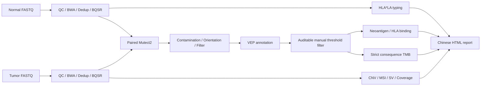

# GAOMEI WES

<p align="center">
  
</p>

<p align="center">
  <strong>A reproducible WES workflow for tumor-normal pairs and single samples</strong>
</p>

<p align="center">
  <a href="https://github.com/Defphoenix/gaomei_wes/releases/tag/v1.0.0"></a>
  <a href="https://github.com/Defphoenix/gaomei_wes/actions/workflows/code-tests.yml"></a>
  <a href="#install-with-mamba"></a>
  
</p>

<p align="center">
  
  
  
  
  
  
</p>

<p align="center">
  <a href="README.md">中文</a> | <strong>English</strong> |
  <a href="docs/V1.0_zh.md">v1.0 notes</a> |
  <a href="docs/install_update_zh.md">installation</a> |
  <a href="docs/software_database_inventory.md">software and databases</a>
</p>

This repository provides a server-deployable Shell/Python WES workflow with
single-sample germline and matched tumor-normal somatic modes. It is suitable
for development, benchmarking, and workflow validation. Clinical or industrial
deployment still requires cohort validation, calibrated reference resources,
and a governed interpretation layer.

## Workflow



The project supports:

- Single-sample germline calling with HaplotypeCaller.
- Matched tumor-normal somatic calling with Mutect2.
- Mutect2 orientation-bias modeling and paired contamination estimation.
- Optional HLA*LA G-group typing with separate two-field class-I binding alleles.
- Strict VEP-CSQ TMB filtering with auditable accepted/rejected tables.
- A post-VEP manual threshold step with a filtered VCF, per-variant audit TSV,
  and JSON summary; downstream neoantigen and TMB modules prefer this VCF.
- One-command project execution plus `step` and `from` debugging.
- VEP 115 offline annotation and 8-15mer neoantigen peptide generation.
- Optional MHCflurry/NetMHCpan binding prediction when HLA alleles are supplied.
- Matched-normal/prebuilt-reference CNVkit analysis; mosdepth-only mode is
  labeled depth QC and does not emit synthetic CNV calls.
- Optional MSIsensor-pro, Manta, coverage, TMB, and summary modules.

In matched mode, normal and tumor roles stop after preprocessing (`through 5d`).
They do not produce independent VCFs. Their final BAMs are passed together to
one paired Mutect2 run in the somatic role. Single-sample germline mode still
uses HaplotypeCaller.

It does not yet provide cohort joint genotyping, assay-calibrated CNV/MSI/TMB
references, or a validated clinical interpretation report.
See [the Chinese audit and roadmap](docs/pipeline_audit_zh.md) for details.
The clean reinstall and matched-sample acceptance procedure is documented in
[Chinese here](docs/clean_reinstall_revalidation_zh.md).

The paired Mutect2 workflow uses `MUTECT2_INTERVAL_PADDING=100` to provide
local-assembly context around capture intervals. This does not modify the
capture BED or TMB denominator. The default post-VEP thresholds are TLOD 6.3,
tumor DP 20, tumor ALT reads 5, tumor AF 2%, normal DP 20, normal ALT reads 2,
normal AF 2%, and maximum population AF 0.1%; missing population AF passes.

## Install With Mamba

```bash
git clone git@github.com:Defphoenix/gaomei_wes.git
cd gaomei_wes

bash scripts/create_conda_envs.sh \
  --env-root /PUBLIC/gomics/guofenghua/envs/wes \
  --mamba-bin mamba \
  --production
```

Created environments:

| Prefix | Purpose |
|---|---|
| `big_wes_pipeline_env` | Core QC, alignment, GATK, VCF, MSI, and reporting tools (Java 17) |
| `wes_vep_env` | Ensembl VEP 115 |
| `wes_snpeff_env` | SnpEff and SnpSift annotation (Java 21) |
| `wes_hla_env` | Optional MHCflurry binding prediction |
| `wes_hla_typing_env` | Optional Linux HLA*LA typing |
| `wes_cnv_env` | Optional CNVkit analysis |
| `wes_sv_env` | Optional archived Manta 1.6.0; add `--with-sv` on Linux |

The installer writes the resolved package list and platform-specific explicit
lock files to `ENV_ROOT/manifests/`, then runs lightweight source regressions.

After a future `git pull`, add `--update-existing` to apply changed YML files
to existing prefixes. Without that flag, existing environments are left intact.

Load the environment paths and test the installation:

```bash
source /PUBLIC/gomics/guofenghua/envs/wes/env.sh
gatk --version
vep --help
bash scripts/run_snpeff_env.sh -version
```

MHCflurry models are downloaded separately:

```bash
mamba run -p /PUBLIC/gomics/guofenghua/envs/wes/wes_hla_env \
  mhcflurry-downloads fetch models_class1_presentation
```

## Reference Layout

```text
reference_data/
  hg38/Homo_sapiens_assembly38.fasta[.fai]
  hg38/Homo_sapiens_assembly38.dict
  dbsnp_146.hg38.vcf.gz[.tbi]
  Mills_and_1000G_gold_standard.indels.hg38.vcf.gz[.tbi]
  1000G_phase1.snps.high_confidence.hg38.vcf.gz[.tbi]
  vep_cache/homo_sapiens/115_GRCh38/
  protein/protein.fa
  mutect2/small_exac_common_3.hg38.vcf.gz[.tbi]
  hla/PRG_MHC_GRCh38_withIMGT/
  tmb/effective_coding_regions.bed
  msisensor/hg38.list
  capture_targets.bed
```

Use a capture BED matching the actual WES kit. A Mutect2 panel of normals,
population germline resource, CNVkit reference, and MSI baseline are
project/cohort resources rather than universal files.

HLA*LA software is installed by mamba, but its approximately 2.3 GB graph is a
separate resource. Run `scripts/prepare_hlala_graph.sh` with the downloaded graph
archive, reference root, and HLA typing env prefix. The helper verifies the
official MD5, extracts, links, and runs `prepareGraph`. Graph preparation can
require about 40 GB RAM; see the [HLA*LA usage page](https://hpc.nih.gov/apps/HLA-LA.html).
Full G-group calls are preserved; two-field alleles are derived only for binding predictors.

## Create And Run A Matched Project

```bash
bash scripts/create_wes_project.sh \
  --mode tumor-normal \
  --tumor-fastq-source /data/TUMOR01 \
  --normal-fastq-source /data/NORMAL01 \
  --out-dir /analysis/TUMOR01_vs_NORMAL01 \
  --tumor-id TUMOR01 \
  --normal-id NORMAL01 \
  --copy-mode link \
  --reference-dir /reference_data \
  --reference-genome /reference_data/hg38/Homo_sapiens_assembly38.fasta \
  --interval-bed /reference_data/capture_targets.bed \
  --env-root /PUBLIC/gomics/guofenghua/envs/wes

cd /analysis/TUMOR01_vs_NORMAL01
bash run_pipeline.sh
```

Debug and resume commands:

```bash
bash run_pipeline.sh check
bash run_pipeline.sh status somatic
bash run_pipeline.sh step somatic 7d
bash run_pipeline.sh from somatic 7c
```

For a single germline sample, use `--mode single`, `--fastq-source`, and
`--sample-id`, then run the generated root `run_pipeline.sh` in the same way.

## Important Boundaries

- NetMHCpan, ANNOVAR, and COSMIC require their own registration or license flow
  and are not downloaded automatically.
- `simple` HLA scoring is an explicit smoke-test mode only. `auto` fails when
  neither NetMHCpan nor MHCflurry is available.
- Mosdepth is used only for explicitly labeled depth QC. CNV calls require
  CNVkit plus a matched-normal or pooled-normal reference.
- MSI without a compatible site list/baseline is not a formal MSI call.
- MultiQC is a QC aggregation report, not a clinical interpretation report.
