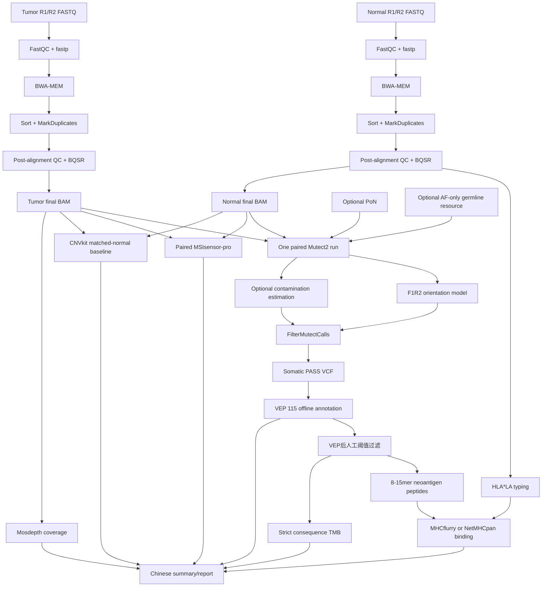

# gaomei_wes v1.0 版本说明

版本：`v1.0.0`

发布日期：2026-07-17

状态：研发验证版，可用于流程复测、benchmark 和队列方法学开发。

## 1. 版本定位

v1.0 同时支持：

1. 单样本胚系 WES：HaplotypeCaller。
2. Tumor-normal 配对 WES：Mutect2。
3. 完整流程和单步调试。
4. 服务器共享环境、共享参考数据库和独立项目目录。

配对模式遵循一个重要原则：normal 和 tumor 的独立阶段只负责生成可分析 BAM，
不会各自重复检测突变。两份最终 BAM 只在 somatic 阶段共同进入一次 Mutect2。

## 2. v1.0 配对流程图



## 3. 步骤职责

| 阶段 | 步骤 | 输入 | 主要输出 |
|---|---|---|---|
| Normal预处理 | 1-5d | Normal FASTQ | BQSR BAM、QC、HLA分型 |
| Tumor预处理 | 1-5d | Tumor FASTQ | BQSR BAM、QC |
| 配对体细胞 | 6-7 | 两份BAM | raw/filtered/PASS VCF、方向偏倚模型、污染表 |
| 注释/免疫 | 7c、7e、7d | PASS VCF、VEP cache、protein FASTA、HLA | VEP VCF、人工过滤审计、8-15mer FASTA/TSV、binding表 |
| CNV | 8 | Tumor/normal BAM或pooled reference | CNVkit CNR/CNS/call；无基线时只有depth QC |
| MSI | 9 | Tumor/normal BAM、位点list | MSI score、unstable/total、MSS/MSI-L/MSI-H |
| SV | 10 | BAM | Manta兼容模块，v1.0默认关闭 |
| 覆盖度 | 11 | 最终BAM、capture BED | mosdepth summary/thresholds |
| TMB | 12 | VEP VCF、有效编码区BED | accepted/rejected表、TMB及参数JSON |
| 汇总 | 13 | 全部结果 | 中文文本/HTML或MultiQC输出 |

## 4. 软件环境

v1.0 使用绝对 prefix，避免 Java/Python/Perl 依赖互相污染。

| 环境 | 关键软件 | 版本策略 |
|---|---|---|
| `big_wes_pipeline_env` | GATK 4.6.2.0、Picard 3.4.0、mosdepth 0.3.14、BWA、Samtools、BCFtools、MSIsensor-pro | Java 17；完整版本记录在manifest |
| `wes_vep_env` | Ensembl VEP 115.2 | 必须配VEP cache 115 |
| `wes_snpeff_env` | SnpEff/SnpSift 5.4.0c | Java 21，与GATK隔离 |
| `wes_hla_env` | MHCflurry | 模型单独下载 |
| `wes_hla_typing_env` | HLA*LA 1.0.4 | Linux；PRG graph单独准备 |
| `wes_cnv_env` | CNVkit 0.9.12、DNAcopy | matched/pooled normal CNV |
| `wes_sv_env` | Manta 1.6.0 | 归档兼容模块，不属于`--production`默认环境 |

安装命令：

```bash
bash scripts/create_conda_envs.sh \
  --env-root /PUBLIC/gomics/guofenghua/envs/wes_v1 \
  --mamba-bin mamba \
  --production
```

## 5. 数据库版本兼容

### 5.1 必须保持一致的版本轴

| 资源组合 | 兼容要求 | 不一致后果 |
|---|---|---|
| FASTA、BED、known-sites、Mutect2资源 | 同为GRCh38，contig名称和字典顺序一致 | 区间无重叠、索引错误或错误过滤 |
| VEP软件、VEP cache | v1.0为115/115 | cache目录找不到或注释不一致 |
| VEP cache、protein FASTA | 推荐均为Ensembl release 115 | ENSP匹配失败，新抗原缺失 |
| HLA*LA软件、PRG graph | graph完成`prepareGraph`且与安装路径链接正确 | 无法分型或重复构建索引 |
| MHCflurry软件、models | 模型由同一环境的`mhcflurry-downloads`安装 | binding预测不可用 |
| Capture BED、MSI list/TMB BED/CNV reference | 同一捕获试剂盒版本 | MSI/TMB/CNV偏差不可控 |
| PoN、normal BAM、tumor BAM | 同参考、流程、平台和试剂盒 | PoN过滤错误或批次伪影残留 |

### 5.2 参考目录建议

```text
reference_data/
  hg38/Homo_sapiens_assembly38.fasta[.fai/.dict/BWA indexes]
  dbsnp_146.hg38.vcf.gz[.tbi]
  Mills_and_1000G_gold_standard.indels.hg38.vcf.gz[.tbi]
  1000G_phase1.snps.high_confidence.hg38.vcf.gz[.tbi]
  mutect2/
    gnomad.af-only.vcf.gz[.tbi]
    small_exac_common_3.hg38.vcf.gz[.tbi]
    panel_of_normals.vcf.gz[.tbi]
  vep_cache/homo_sapiens/115_GRCh38/
  protein/protein.fa
  hla/PRG_MHC_GRCh38_withIMGT/
  cnvkit/reference.cnn
  msisensor/<capture-kit>.list
  tmb/effective_coding_regions.bed
  capture_targets.bed
```

## 6. 运行方式

生成配对项目后，项目根目录只需：

```bash
bash run_pipeline.sh
```

实际执行顺序：

```text
normal through 5d -> tumor through 5d -> somatic full
```

也可以分开运行：

```bash
bash run_pipeline.sh normal
bash run_pipeline.sh tumor
bash run_pipeline.sh somatic
```

单步调试：

```bash
bash run_pipeline.sh step normal 5c
bash run_pipeline.sh through tumor 5d
bash run_pipeline.sh step somatic 7c
bash run_pipeline.sh from somatic 8
```

## 7. v1.0 真实数据验证结论

真实配对 WES 运行确认了以下链路可执行：

- 两份 FASTQ 到去重/BQSR BAM。
- HLA*LA normal样本分型和HLA-I binding等位基因转换。
- 配对 Mutect2、F1R2模型、FilterMutectCalls和PASS VCF。
- VEP、新抗原、HLA binding、MSI、覆盖度、TMB和汇总。

验证中发现并修复的错误记录在 `CHANGELOG.md`。MSI解析器现在拒绝读取自己生成的
旧summary，并校验score范围；BAM进入Mutect2、CNV、覆盖度前必须通过
`samtools quickcheck`。

## 8. v1.0 已知边界

1. 没有PoN和AF-only germline resource时可研发运行，但假阳性控制不完整。
2. CNVkit单matched normal可复测，正式生产仍需同平台pooled normal reference。
3. MSI和TMB阈值必须按capture kit和癌种完成方法学验证。
4. Manta已归档，v1.0默认不启用SV。
5. HLA*LA的G-group/多字段结果不等同于所有位点都确定到无歧义8位。
6. 新抗原预测是候选排序，不等同于免疫原性临床结论。
7. 报告是研发汇总，不是经过审核的临床报告系统。

## 9. v1.0 后续验证路线

1. 使用30-100份同平台normal建立PoN。
2. 使用同批次normal建立CNVkit pooled reference。
3. 构建0.5%-20% VAF、不同深度和不同变异类型的LOD梯度。
4. 测试批内/批间重复性、准确性、特异性和最低肿瘤纯度。
5. 验证panel MSI/TMB阈值并锁定数据库版本和校验值。
