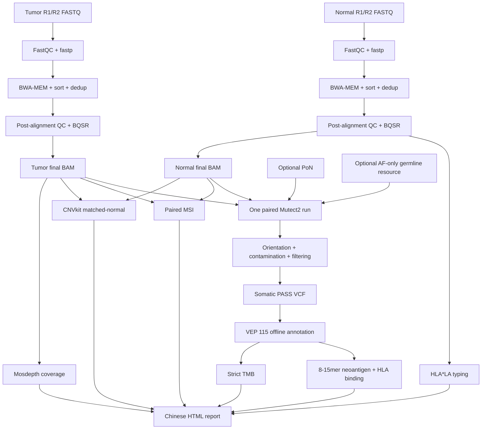

# GAOMEI WES Wiki

`gaomei_wes` 是一个面向肿瘤-正常配对和单样本胚系分析的 WES 工作流。当前稳定
研发版本为 `v1.0.0`，支持服务器共享环境、共享参考数据库、项目自动生成、完整
运行以及单步恢复调试。

> **使用边界：** v1.0 可用于科研、benchmark、流程复测和方法学开发，尚未完成
> 临床诊断所需的全套队列验证、质量体系和知识库审核。

## 快速导航

- [[安装与升级]]：首次安装、Mamba 环境、模型和 HLA graph 准备。
- [[数据库与版本兼容]]：GRCh38、VEP 115、蛋白 FASTA、PoN、CNV/MSI/TMB资源。
- [[运行方式]]：单样本、配对项目、完整运行和断点续跑。
- [[v1.0-发布说明]]：v1.0 已实现能力、修复记录和已知边界。
- [[LOD与PoN规划]]：PoN、LOD、重复性和正式上线前验证路线。
- [GitHub 主仓库](https://github.com/Defphoenix/gaomei_wes)

## v1.0 配对分析逻辑



Normal 和 tumor 的独立阶段只负责生成最终 BAM，不分别调用突变。两份 BAM 在
somatic 阶段共同进入一次 paired Mutect2。单样本胚系模式继续使用
HaplotypeCaller。

## 核心模块

| 模块 | 主要工具 | v1.0 输出 |
|---|---|---|
| FASTQ QC与修剪 | FastQC、fastp | QC HTML/JSON、clean FASTQ |
| 比对和校准 | BWA、Samtools、Picard、GATK BQSR | dedup/BQSR BAM、QC指标 |
| 体细胞变异 | Mutect2、FilterMutectCalls | raw、filtered、PASS VCF |
| 功能注释 | VEP 115、可选SnpEff | VEP VCF/TSV、注释统计 |
| HLA和新抗原 | HLA*LA、MHCflurry/NetMHCpan | HLA分型、8-15mer FASTA、binding表 |
| CNV | CNVkit | CNR/CNS/call；无基线时仅depth QC |
| MSI | MSIsensor-pro | score、unstable/total、分型 |
| TMB | VEP CSQ严格筛选 | accepted/rejected、TMB、参数JSON |
| 汇总 | Python、MultiQC | 中文HTML和QC汇总 |

## 最短开始路径

```bash
git clone https://github.com/Defphoenix/gaomei_wes.git
cd gaomei_wes

bash scripts/create_conda_envs.sh \
  --env-root /PUBLIC/gomics/guofenghua/envs/wes \
  --mamba-bin mamba \
  --production
```

软件安装完成后仍需准备参考数据和模型。不要在缺少 VEP cache、蛋白 FASTA、
capture BED 或必要索引时直接开始正式样本。
